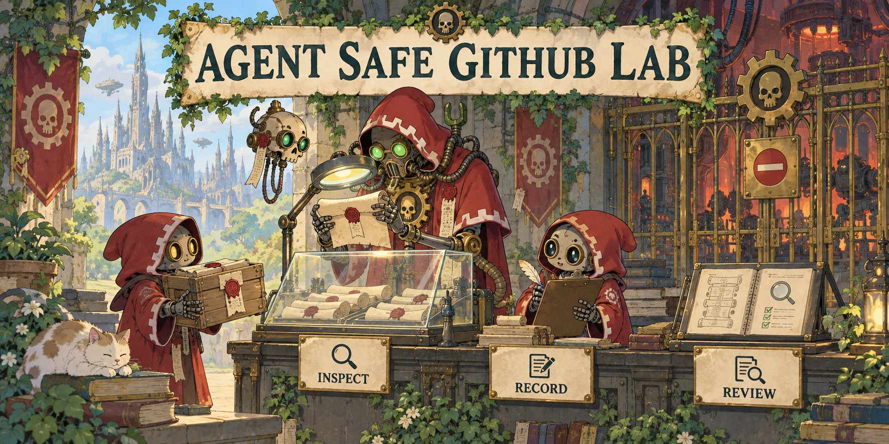

# Agent Safe GitHub Lab



**Inspect external sources before an AI agent follows their instructions.**

A learning lab with inert exercises and a standard-library Python scanner. It reads
an existing local directory and records suspicious signals in a bounded static receipt.
It never downloads, installs, executes source files, or sends network requests.

## Try it

Python 3.11+ is sufficient. From this repository:

```sh
python3 -m unittest discover -s tests -v
python3 -m gate fixtures/clean --json
```

Compare with `python3 -m gate fixtures/second-stage --json`.
Exit code `1` is expected for findings requiring review.
Scan fixtures; never execute their files or follow their illustrative URLs.

## Learn the boundaries

The exercises cover prompt injection, second-stage downloads, secret-to-network
paths, mutable references, CI privileges, lifecycle scripts and hidden build sources.
Receipts include categories, relative paths, line numbers and content digests, never
source excerpts. Paths can still reveal sensitive names: review receipts before sharing.

`STATIC_REVIEW_COMPLETE` means the bounded static review finished, not authorization
to execute. The scanner is a teaching heuristic, not a runtime sandbox or proof of safety.
Runtime containment and admission decisions require separate controls and review.

[Russian guide](../README.md) · [Threat model](THREAT_MODEL.md) ·
[Exercises](../exercises/) · [Primary sources](SOURCES.md)

[Apache-2.0](../LICENSE). [Companion project: Agent Project Kit](https://github.com/kostyaP-hub/agent-project-kit)
provides project context, rules and opt-in hooks.
